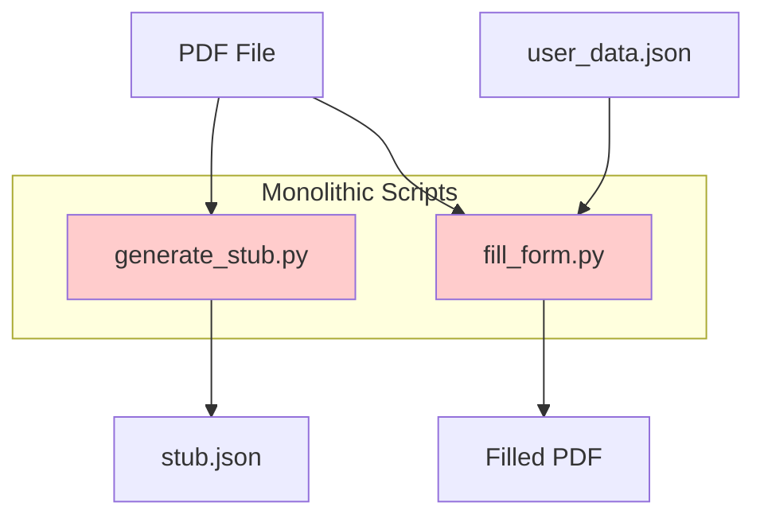
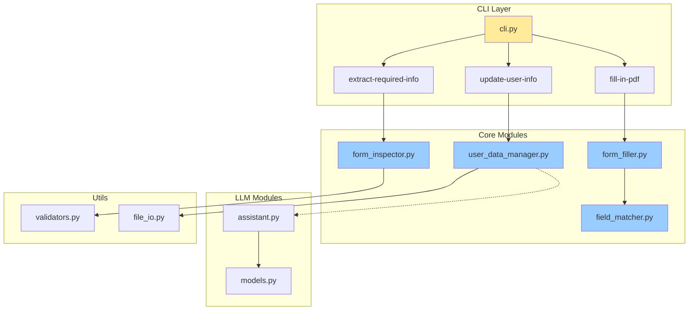
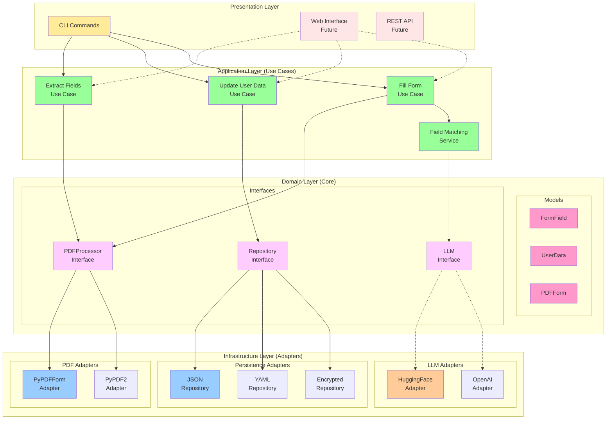
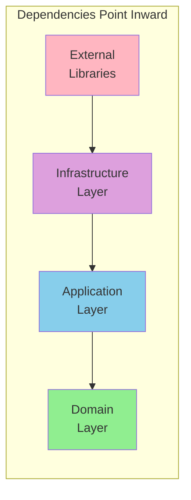
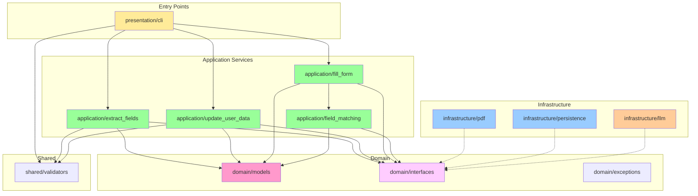
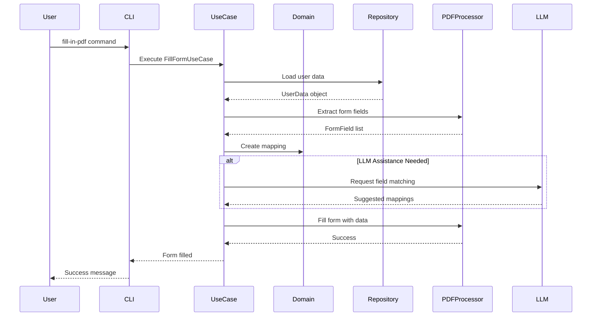
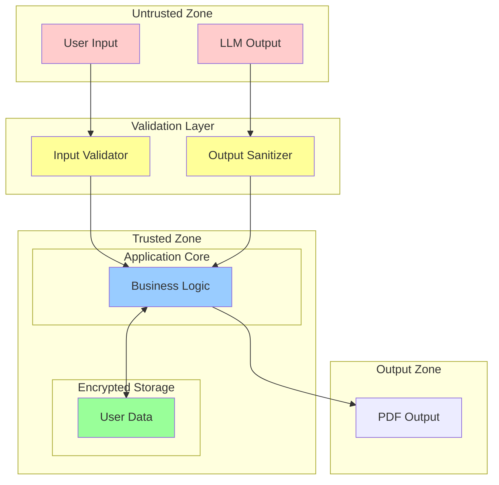
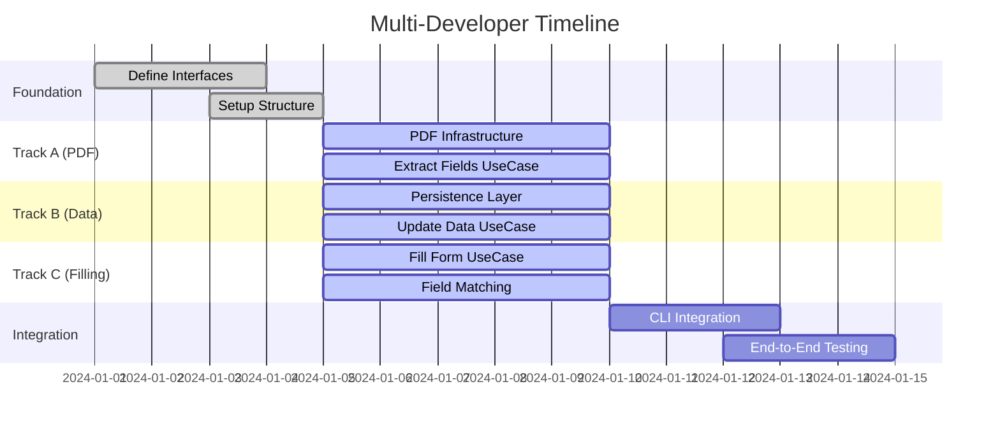
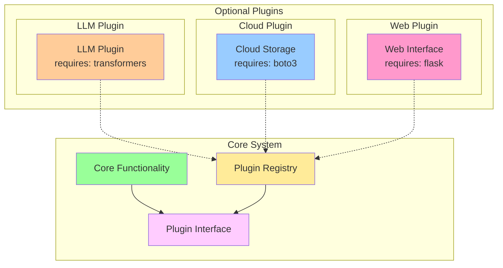
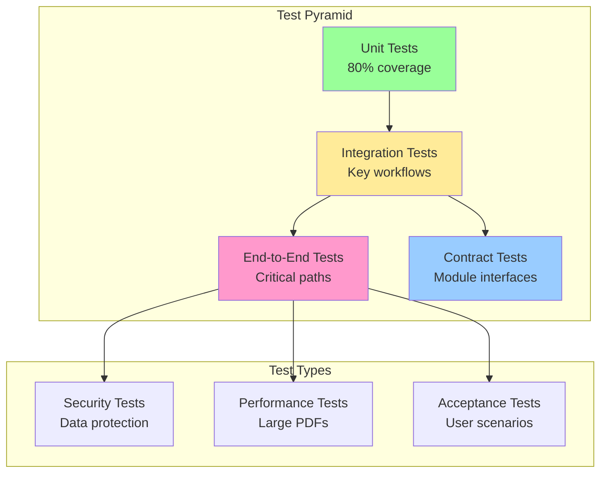

# Architecture Diagrams

## Current Architecture (Legacy)

## Proposed Architecture (From DEV_PLAN.md)

## Recommended Hexagonal Architecture

## Dependency Flow (Clean Architecture)

## Module Dependency Graph (Recommended)

## Data Flow Diagram

## Security Boundaries

## Parallel Development Workflow

## Plugin Architecture

## Testing Strategy

## Legend

### Colors
- 🟨 Yellow: Presentation/Interface Layer
- 🟩 Green: Application/Business Logic Layer
- 🟦 Blue: Infrastructure/External Layer
- 🌸 Pink: Domain/Core Layer
- 🟪 Purple: Abstract/Interface Layer
- 🟥 Red: Security Concern/Legacy Code

### Line Types
- Solid Line (→): Direct dependency
- Dotted Line (-.->): Optional/plugin dependency
- Double Arrow (↔): Bidirectional communication
